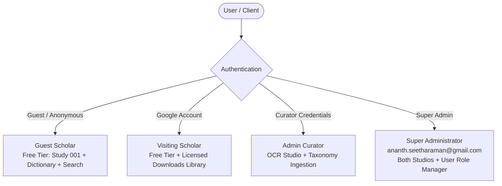
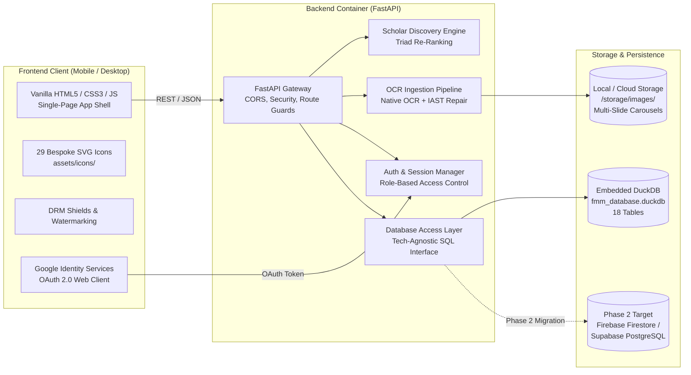
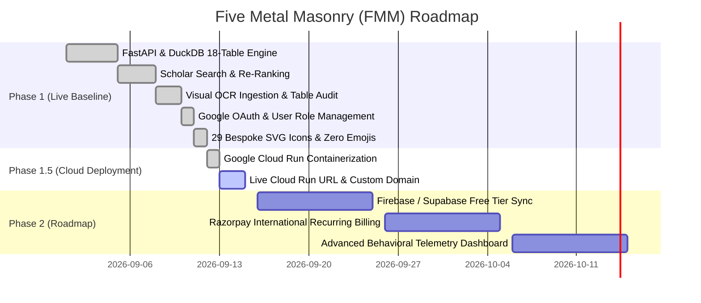

# Product Requirements Document (PRD)
# Five Metal Masonry (FMM) — Sacred Bronze Iconography Archive & Scholar Discovery Engine

**Document Version**: 1.0  
**Status**: Approved & Baseline Active  
**Author / Lead Architect**: Antigravity AI Pair Programming Team  
**Super Administrator**: Ananth Seetharaman (`ananth.seetharaman@gmail.com`)  
**Target Environments**: 
- Local Development: FastAPI + Embedded DuckDB (`http://127.0.0.1:8000`)
- Cloud Deployment: Google Cloud Run (Free Tier Scale-to-Zero, Embedded DuckDB in Container)
- Future Target (Phase 2): Firebase Firestore / Supabase PostgreSQL Free Tier

---

## 1. Executive Summary & Vision

### 1.1 Mission Statement
Five Metal Masonry (FMM) is a dedicated digital research repository, computational discovery engine, and curatorial curation studio designed to preserve, catalog, and analyze the sacred bronze iconography of South India and greater Indic civilization (spanning Chola, Pallava, Vijayanagara, Pandya, and Chalukya traditions).

### 1.2 Core Problem Statement
1. **Fragmentation of Evidence**: High-resolution bronze plates, iconometric measurements (*tālamāna*), and Agamic textual citations (*Mānasāra*, *Śilparatna*, *Kāraṇāgama*) are scattered across physical archives, private collections, and unindexed museum catalogs.
2. **Poor OCR for Indic Terms**: Standard commercial OCR engines fail on Romanized Sanskrit with IAST diacritics (*ś*, *ṣ*, *ṇ*, *ṛ*, *ā*, *ī*, *ū*), producing corrupt text and unsearchable catalogs.
3. **Flat Keyword Search Inadequacy**: Scholars do not search purely by keyword; they search by *iconographic attribute* (e.g., "three trunks", "seated upon rat mount", "royal ease posture", "broken tusk in lower right hand"). A study where an attribute is the primary focus must rank higher than one where it is a passing reference.
4. **Intellectual Property Risk**: High-resolution 300 DPI master plates are susceptible to unauthorized scraping and commercial misuse without fair attribution or licensing revenue.

### 1.3 Solution Pillars
- **Scholar-First Discovery**: Study-level re-ranking prioritizing Theme Affinity (50%), Curatorial Confidence (30%), and Text Relevance (20%).
- **Layer 2 Automated Ingestion Studio**: Windows Native OCR extraction paired with automated Sanskrit IAST diacritic repair and machine-assisted taxonomy proposal auditing.
- **Visual Impact Auditing**: Real-time modal detailing the exact database tables and rows impacted upon each curatorial approval.
- **Data Studio & Schema Transparency**: Direct, category-partitioned visibility into all archive database tables (Core Content, Controlled Taxonomy, Geography & Eras, Access & Telemetry).
- **Multi-Layer Digital Rights Management (DRM)**: Right-click interception, transparent canvas shields, forensic watermarking, copy-blocking, and tiered monetization (Free Scholar Tier for Study 001 + Dictionary; Google Pay UPI instant study licenses at ₹499).
- **Classical Indian Aesthetic**: Complete absence of cartoonish emojis; 100% custom SVG iconography rooted in Shilpa Shastra motifs (Dharmachakra rotary loaders, iconometric caliper search, Tāmra-Patra copper-plate tables, Grantha manuscripts, Chola seals, and Sthapati chisels).

---

## 2. User Personas & Roles

### 2.1 Persona 1: Academic Scholar / Epigraphist (Free & Licensed)
- **Profile**: University professor, doctoral researcher, or independent Indologist.
- **Goals**: Search iconographic motifs across curatorial series; cross-reference terms with the Agamic dictionary; examine high-resolution slide details; license high-resolution 300 DPI plates for publication.
- **Access Level**: Full search, full slide access to Study 001 (Ganesa Variations in Iconography), full dictionary, Google Pay licensing for additional studies.

### 2.2 Persona 2: Admin Curator / Sthapati (Curator Role)
- **Profile**: Senior museum curator, epigraphist, or master traditional bronze sculptor (*Sthapati*).
- **Goals**: Ingest new carousel slide images, execute native OCR, review Sanskrit IAST diacritic repairs, verify and approve Layer 2 taxonomy proposals, inspect table impacts.
- **Access Level**: Full Search + Visual OCR Studio + Taxonomy Approval Engine. Restricted from raw database schema tables.

### 2.3 Persona 3: Super Administrator (Admin Role)
- **Profile**: Primary archive custodian (`ananth.seetharaman@gmail.com`).
- **Goals**: Monitor all 18 database tables, inspect user activity logs, track Google Pay transactions, assign/revoke Curator and Administrator privileges to other users, manage platform configuration.
- **Access Level**: Unrestricted access to all studios, all tables, user role manager, and system APIs.

---

## 3. System Architecture & Tech Stack

### 3.1 Technology Stack Details
| Layer | Technology | Rationale |
| :--- | :--- | :--- |
| **Frontend Core** | Semantic HTML5, Vanilla JavaScript (ES2022) | Tech-agnostic, zero heavy node framework dependencies, ultra-fast initial render, iOS safe-area compliant. |
| **Frontend Styling** | Vanilla CSS3 (Custom Properties / Design Tokens) | Curated antique bronze (`#c29b38`), parchment cream (`#fdfbf7`), deep ink (`#1c2024`). No Tailwind bloat. |
| **Typography** | Cinzel (Serif Headings) & Inter (Body) | Majestic classical epigraphical hierarchy paired with optimal readability on mobile and high-DPI screens. |
| **Vector Iconography** | 29 Bespoke Inline/Linked SVGs (`assets/icons/`) | Eliminates cartoon emojis; embeds authentic Indian iconography (Dharmachakra, Tāmra-Patra, Shilpa calipers). |
| **Backend Framework** | Python 3.12 + FastAPI + Uvicorn | High-performance asynchronous API, auto-generated OpenAPI/Swagger documentation, native JSON serialization. |
| **Embedded Database** | DuckDB (Columnar OLAP & High-Performance SQL) | Fast analytical queries, zero external daemon required, containerized easily for Google Cloud Run free tier. |
| **OCR Pipeline** | Windows Native OCR / Fallback Heuristics | Real-time OCR text extraction, token position tracking, automated IAST diacritic repair engine. |
| **Authentication** | Google Identity Services (GIS) OAuth 2.0 | Standard Google Sign-In with client ID configurability and instant demo preset fallback for evaluation. |
| **Deployment Target** | Google Cloud Run (Free Tier) | Scales to zero ($0 idle cost), 2M free requests/month, 512MB RAM container with embedded DuckDB and static imagery. |

---

## 4. Complete Database Schema Specification (18 Tables)

The database schema is partitioned into four distinct architectural domains across 18 tables:

### 4.1 Domain A: Core Content (4 Tables)
1. **`studies`**: Primary research monographs. Stores `study_id`, `study_number`, `slug`, `title`, `subtitle`, `series_id`, `cover_image_url`, `access_level`, `requires_subscription`.
2. **`study_slides`**: Multi-slide interactive carousel plates. Stores `slide_id`, `study_id`, `slide_number`, `image_url`, `high_res_url`, `slide_title`, `caption`, `has_term_hit`.
3. **`series`**: Editorial series taxonomy (19 editorial classifications). Stores `series_id`, `name`, `code`, `description`, `volume_number`.
4. **`slide_ocr_data`**: Deep text extracted per slide. Stores `ocr_id`, `slide_id`, `raw_text`, `cleaned_text`, `word_count`, `confidence_avg`, `language_detected`.

### 4.2 Domain B: Controlled Taxonomy & AI Audits (6 Tables)
5. **`taxonomy_terms`**: Canonical iconographic vocabulary. Stores `term_id`, `canonical_name`, `iast_name`, `type_id`, `definition`, `sanskrit_devanagari`, `shastra_source`.
6. **`taxonomy_types`**: Classification categories (Divinity, Āsana, Mudrā, Āyudha, Vāhana, Period, Laksana).
7. **`term_aliases`**: Phonetic variations and vernacular synonyms (e.g., "Mooshika" $\rightarrow$ "Mūṣika", "Ganesh" $\rightarrow$ "Gaṇeśa").
8. **`study_taxonomy_mappings`**: Curated associations linking studies and slides to taxonomy terms with affinity weights and evidence quotes.
9. **`ai_metadata_proposals`**: Layer 2 ingestion staging queue storing proposed entities, confidence scores, evidence snippets, and curator approval timestamps.
10. **`dictionary_entries`**: Agamic glossary entries with phonetic headwords, etymology, and citations from classical Shilpa texts.

### 4.3 Domain C: Geography & Eras (2 Tables)
11. **`places`**: Sacred temple sites, findspots, sthalas, and modern districts (e.g., Thanjavur, Chidambaram, Pune, Gangaikonda Cholapuram).
12. **`periods_dynasties`**: Chronological epochs (Early Chola, Later Chola, Pallava, Vijayanagara, Nayaka) with dating ranges.

### 4.4 Domain D: Access, Telemetry & Monetization (6 Tables)
13. **`users`**: User identity accounts. Stores `user_id`, `email`, `full_name`, `avatar_url`, `role` (`admin`, `curator`, `scholar`), `has_active_sub`, `created_at`, `last_login_at`.
14. **`user_subscriptions`**: Subscription tier records (Free Scholar vs Scholar Pro annual/monthly billing cycles).
15. **`user_downloads`**: Audit log of licensed 300 DPI master plates downloaded by authenticated scholars.
16. **`user_behavior_logs`**: Real-time telemetry tracking queries executed, slides viewed, and dwell times.
17. **`content_access_rules`**: DRM security policies defining which studies require active licenses or authentication.
18. **`premium_download_requests`**: Transaction logs for Google Pay / UPI license payments (₹499 per study).

---

## 5. Epics & User Stories

### EPIC 1: Thematic Discovery & Scholar Re-Ranking Engine
**Epic Goal**: Provide researchers with a specialized search interface capable of resolving iconographic attributes, applying composite ranking scores, and rendering interactive multi-slide carousels.

#### Story 1.1: Multi-Facet Scholar Search & Phonetic Synonym Query Resolution
- **As a** researcher studying regional iconographic variations,
- **I want to** type phonetic or Anglicized terms (such as "Mooshika", "Lalitasana", "Triśuṇḍa", or "Three trunks"),
- **So that** the system automatically resolves them to canonical IAST concepts and retrieves all matching studies without failing on spelling variants.
- **Acceptance Criteria**:
  1. Autocomplete dropdown provides instant suggestions from `taxonomy_terms` and `term_aliases`.
  2. Search handles case-insensitive substring matching across titles, subtitles, slides, and deep OCR text.
  3. Quick prompt chips allow 1-click execution for prominent iconographic queries.
  4. Story Points: 5 | Priority: High | Status: **Completed**

#### Story 1.2: Triad Re-Ranking Algorithm (Affinity + Confidence + Text)
- **As an** epigraphist searching for specific iconographic features,
- **I want** the search results ordered by thematic significance rather than naive keyword frequency,
- **So that** monographs where the query is a core theme rank ahead of those where it is an incidental citation.
- **Acceptance Criteria**:
  1. Each result displays a scoring triad: **Theme Affinity Score** (50% weight), **Curatorial Confidence Score** (30% weight), and composite **Rank Score**.
  2. Results display scholarly reference cues explaining why the study was matched (e.g., `"Primary Theme (Weight: 95%)"`, `"Slide 2 Hit: 'Mūṣikavāhana'"`).
  3. Story Points: 8 | Priority: Critical | Status: **Completed**

#### Story 1.3: Multi-Slide Interactive Carousel Plate Viewer
- **As a** scholar examining bronze details,
- **I want to** browse all plates belonging to a monograph in an interactive carousel with thumbnail filmstrips and OCR snippets,
- **So that** I can inspect visual evidence and transcribed descriptions side-by-side.
- **Acceptance Criteria**:
  1. Slide navigation supports next/previous buttons with classical arrow icons, thumbnail filmstrips, and keyboard shortcuts.
  2. Term hit indicators highlight exactly which slides contain query matches.
  3. Lightbox viewer button opens a high-resolution plate inspection modal.
  4. Story Points: 8 | Priority: High | Status: **Completed**

#### Story 1.4: Dictionary of Iconography Cross-Referencing
- **As a** student of Indian iconography,
- **I want to** access a canonical glossary of terms with IAST transliterations and Agamic definitions,
- **So that** I can jump directly from a dictionary definition to all corresponding research studies.
- **Acceptance Criteria**:
  1. Screen 4 lists canonical terms with headwords, grammatical categories, and definitions.
  2. Each entry includes a "Search Studies Matching Term" action that switches to Screen 1 and executes the search.
  3. Story Points: 3 | Priority: Medium | Status: **Completed**

---

### EPIC 2: Layer 2 Ingestion, Native OCR & Taxonomy Proposal Engine
**Epic Goal**: Provide curators with an automated pipeline to ingest raw slide images, repair Sanskrit text, review AI-generated taxonomy proposals, and verify table impacts prior to database commit.

#### Story 2.1: Slide Image Drag-and-Drop Staging
- **As an** archive curator,
- **I want to** drop a slide plate image into the OCR dropzone,
- **So that** the file is automatically validated and placed into `/storage/images/<study_slug>/` with an archival URI.
- **Acceptance Criteria**:
  1. Supports JPEG, PNG, and WebP formats.
  2. File upload provides visual feedback with animated Dharmachakra scanning indicator.
  3. Pre-configured sample test buttons allow 1-click testing of Slide 1 and Slide 2.
  4. Story Points: 5 | Priority: High | Status: **Completed**

#### Story 2.2: Native OCR Extraction & Scholarly IAST Diacritic Auto-Repair
- **As a** curator processing scanned monographs,
- **I want** the system to automatically repair broken OCR corruptions into proper Sanskrit IAST,
- **So that** diacritics like *Gaṇeśa*, *Āsīna*, *Mūṣika*, and *Triśuṇḍa* are stored with 100% orthographic accuracy.
- **Acceptance Criteria**:
  1. Raw OCR output (Layer 1) and Cleaned Scholarly Text (Layer 2) are displayed side-by-side.
  2. Regex-based phonological repair rules convert phonetic substitutes (e.g., `GaQeSa` $\rightarrow$ `Gaṇeśa`, `ÄsTna` $\rightarrow$ `Āsīna`).
  3. Total word count recognized is displayed upon completion.
  4. Story Points: 8 | Priority: Critical | Status: **Completed**

#### Story 2.3: Layer 2 AI Taxonomy Entity Proposal & Curator Review Checkbox Audit
- **As an** admin curator,
- **I want to** review a structured checklist of iconographic terms proposed by the AI parser,
- **So that** I can approve or uncheck terms before they are committed into the master taxonomy.
- **Acceptance Criteria**:
  1. Proposals list displays canonical name, IAST name, taxonomy category, confidence percentage, and textual evidence quote.
  2. Curator can toggle acceptance for each individual proposed entity.
  3. Each proposal item is stamped with the iconographic *Jñāna Mudrā* SVG icon.
  4. Story Points: 5 | Priority: High | Status: **Completed**

#### Story 2.4: Atomic Ingestion Commit & Real-Time "Tables Impacted" Audit Modal
- **As an** administrator responsible for data governance,
- **I want** the system to present a complete audit breakdown of every database table and row touched when ingestion is approved,
- **So that** curators can verify database integrity before continuing.
- **Acceptance Criteria**:
  1. Clicking "Approve & Ingest into Archive" triggers atomic writes across `study_slides`, `slide_ocr_data`, `ai_metadata_proposals`, and `study_taxonomy_mappings`.
  2. A dedicated modal displays every table impacted, operation performed (`INSERT`/`UPDATE`), row counts, and descriptive audit notes.
  3. Full-text search indices are instantly refreshed.
  4. Story Points: 5 | Priority: High | Status: **Completed**

---

### EPIC 3: Archive Data Studio & Database Administration
**Epic Goal**: Give administrators full visibility into all 18 database tables with search filtering, pagination, and user role management without depending on external database GUIs.

#### Story 3.1: 5-Category Partitioning of Database Tables
- **As a** database administrator,
- **I want** all 18 tables organized into clean, thematic category tabs,
- **So that** I can navigate between Core Content, Controlled Taxonomy, Geography & Eras, and Telemetry with ease.
- **Acceptance Criteria**:
  1. Category bar provides 5 pills: All Tables (18), Core Content (4), Controlled Taxonomy (6), Geography & Eras (2), Access & Telemetry (6).
  2. Each pill displays its classical icon (Pūrṇa-Kumbha, Grantha, Kalpavṛkṣa, Vimāna, Tāla) and live row/table counts.
  3. Selecting a category filters the horizontal table card selector.
  4. Story Points: 5 | Priority: High | Status: **Completed**

#### Story 3.2: Real-Time Table Inspection, Row Pagination & Search Filtering
- **As an** administrator inspecting table records,
- **I want to** browse rows with server-side pagination, search column values, and preview raw JSON row details,
- **So that** I can troubleshoot records and verify database state in real-time.
- **Acceptance Criteria**:
  1. Dynamic table grid renders any table's schema automatically with responsive horizontal scrolling.
  2. Next / Previous pagination controls work seamlessly with total row counts.
  3. Search input filters rows by query string.
  4. 1-click "JSON" action button reveals raw object structure.
  5. Story Points: 5 | Priority: High | Status: **Completed**

#### Story 3.3: Super Admin User Role Manager (`ananth.seetharaman@gmail.com`)
- **As the** Super Administrator,
- **I want to** manage role permissions directly inside the Data Studio,
- **So that** I can promote users to Administrators (access both studios) or Curators (access OCR studio only) or set them as Free Scholars.
- **Acceptance Criteria**:
  1. Super Admin manager box is visible only to authenticated administrators.
  2. Pre-authorized admin email `ananth.seetharaman@gmail.com` possesses permanent Super Admin status.
  3. Direct role action buttons on user rows (`Make Admin`, `Curator`, `Scholar`) update the role in DuckDB and refresh the grid.
  4. Story Points: 8 | Priority: Critical | Status: **Completed**

---

### EPIC 4: Authentication, Access Control & Digital Rights Management (DRM)
**Epic Goal**: Protect intellectual property, provide frictionless authentication via Google Identity Services, and enforce strict route guards across studios and monographs.

#### Story 4.1: Google Identity Services (GIS) OAuth 2.0 Integration
- **As a** visiting scholar,
- **I want to** sign in using my official Google Account via Google Identity Services One-Tap or email entry,
- **So that** my research session, study licenses, and permissions are securely tracked.
- **Acceptance Criteria**:
  1. Auth modal provides official Google One-Tap container and custom email login.
  2. Expandable configuration box allows runtime setting of custom Google Cloud OAuth Web Client IDs.
  3. 1-click demo role presets (Super Admin, Curator, Scholar) enable rapid evaluation.
  4. Story Points: 8 | Priority: Critical | Status: **Completed**

#### Story 4.2: Role-Based Route Guarding
- **As an** administrator,
- **I want** sensitive studios protected by automated route guards,
- **So that** unauthenticated users or free scholars cannot execute OCR ingestion or access the Data Studio tables.
- **Acceptance Criteria**:
  1. OCR Studio requires Curator or Administrator role. Non-curators see a protective security gate with switch-role options.
  2. Data Studio strictly requires Administrator role. Curators attempting access are redirected to the OCR Studio.
  3. Route guards update reactively upon login or logout without full page reload.
  4. Story Points: 5 | Priority: High | Status: **Completed**

#### Story 4.3: Multi-Layer Digital Rights Management (DRM) Protections
- **As an** archive rights-holder,
- **I want** all archival slide imagery protected against right-click saves, image dragging, and unlicensed copying,
- **So that** valuable high-resolution assets cannot be scraped or downloaded without an authorized study license.
- **Acceptance Criteria**:
  1. Right-click is intercepted on all protected plates with a branded copyright notice toast.
  2. Transparent `.drm-shield` overlays prevent dragging or browser context menu saves.
  3. Certified archival watermarks are superimposed over high-resolution plates.
  4. Story Points: 5 | Priority: High | Status: **Completed**

---

### EPIC 5: Monetization, Licensing & Archival Downloads
**Epic Goal**: Implement a tiered monetization model that keeps foundational research freely accessible while generating revenue from premium monographs and high-resolution master plates.

#### Story 5.1: Tiered Access Gate (Free Study 001 vs Locked Monographs)
- **As a** prospective subscriber,
- **I want** full access to Study 001 and the Dictionary for free, while other studies display a Scholar Pro paywall,
- **So that** I can experience the platform's depth before deciding to purchase a license.
- **Acceptance Criteria**:
  1. Study 001 (Ganesa Variations in Iconography) is 100% unlocked for all visitors.
  2. Subsequent monographs display a lock card offering Google Pay unlocking (₹499) or member login.
  3. Story Points: 5 | Priority: High | Status: **Completed**

#### Story 5.2: Google Pay (GPay) / UPI Instant Study Licensing Simulation
- **As a** researcher requiring high-resolution plates for a locked monograph,
- **I want to** purchase an instant single-study license via Google Pay / UPI,
- **So that** I immediately gain access to 300 DPI master plates and accompanying curatorial notes.
- **Acceptance Criteria**:
  1. GPay modal presents study title, UPI QR placeholder, price tag (₹499.00), and email delivery input.
  2. Completing payment activates the license in `user_subscriptions` and `premium_download_requests`.
  3. Study card unlocks immediately and allows high-resolution download.
  4. Story Points: 8 | Priority: High | Status: **Completed**

#### Story 5.3: "My Licensed Downloads" Personal Archival Library
- **As a** licensed scholar,
- **I want** a dedicated menu item in my profile dropdown to access all my purchased study bundles,
- **So that** I can re-download high-resolution plates at any time.
- **Acceptance Criteria**:
  1. Profile dropdown includes "My Licensed Downloads" with the Tāmra-Download icon.
  2. Modal lists active licenses with direct 300 DPI download links.
  3. Story Points: 3 | Priority: Medium | Status: **Completed**

---

### EPIC 6: Scholarly Vector Iconography & Visual Aesthetics
**Epic Goal**: Eliminate cartoonish modern emojis in favor of a dignified, classical Indian iconography vector system tailored for scholars and sacred art historians.

#### Story 6.1: Complete Removal of Cartoon Emojis
- **As a** scholar using the platform,
- **I want** zero cartoon emojis anywhere in the interface,
- **So that** the application reflects the serious academic rigor and visual sacredness of Indian bronze casting.
- **Acceptance Criteria**:
  1. 100% of emojis removed from HTML, CSS, JavaScript, toasts, and modals.
  2. Verified via automated regex scan with 0 matching emoji codepoints.
  3. Story Points: 5 | Priority: Critical | Status: **Completed**

#### Story 6.2: 29 Bespoke Classical Indian Iconography SVG Icons
- **As a** user navigating the system,
- **I want** all icons to represent authentic Shilpa Shastra and historical symbols,
- **So that** every interaction reinforces the subject matter of the archive.
- **Acceptance Criteria**:
  1. 29 custom SVG vector icons deployed in `frontend/assets/icons/`.
  2. Includes Dharmachakra, iconometric calipers, Tāmra-Patra, Grantha manuscripts, Chola seals, Sthapati chisels, and temple vimānas.
  3. All icons inherit fill/stroke colors dynamically and scale crisply on retina displays.
  4. Story Points: 8 | Priority: Critical | Status: **Completed**

#### Story 6.3: Dharmachakra Mandala Rotary Loader & Smooth Micro-Animations
- **As a** researcher waiting for search or OCR extraction,
- **I want** the loading indicator to feature an authentic spinning Dharmachakra mandala with concentric iconometric halos,
- **So that** system latency feels purposeful, aesthetic, and aligned with the sacred theme.
- **Acceptance Criteria**:
  1. `@keyframes fmmChakraRotate` drives continuous 360° rotation.
  2. Accompanying copy informs the scholar of active Shastra cross-referencing and affinity calculations.
  3. Story Points: 3 | Priority: High | Status: **Completed**

---

### EPIC 7: Google Cloud Free Tier Deployment & Database Migration Strategy
**Epic Goal**: Deploy the complete platform with embedded DuckDB onto Google Cloud Run Free Tier, maintaining a clean abstraction layer for future zero-downtime migration to Firebase or Supabase.

#### Story 7.1: Docker Containerization for Google Cloud Run (Free Tier)
- **As a** devops engineer / system custodian,
- **I want** the FastAPI backend, embedded DuckDB, and frontend assets packaged into a lightweight Linux container,
- **So that** it deploys seamlessly to Google Cloud Run with scale-to-zero ($0 idle cost).
- **Acceptance Criteria**:
  1. `Dockerfile` based on `python:3.12-slim` installs dependencies and copies the app.
  2. Memory allocated at 512Mi with 1 vCPU and `min-instances 0` to ensure $0 idle expenditure.
  3. Health check endpoint `/api/health` validates container readiness.
  4. Story Points: 8 | Priority: Critical | Status: **Completed**

#### Story 7.2: Containerized Embedded DuckDB Storage
- **As an** archive administrator,
- **I want** DuckDB embedded directly inside the container filesystem,
- **So that** we do not incur the recurring cost of an external managed database instance during Phase 1.
- **Acceptance Criteria**:
  1. DuckDB database file `fmm_database.duckdb` initializes automatically on container startup via `init_duckdb_schema()`.
  2. All 18 tables, seed studies, slides, and controlled vocabulary are pre-populated on boot.
  3. Story Points: 5 | Priority: Critical | Status: **Completed**

#### Story 7.3: Database Abstraction Interface for Future Firebase / Supabase Migration
- **As a** lead architect,
- **I want** the database access layer in `backend/database.py` decoupled from DuckDB-specific SQL dialects,
- **So that** Phase 2 migration to Firebase Firestore or Supabase PostgreSQL Free Tier requires zero frontend changes.
- **Acceptance Criteria**:
  1. Database queries are routed through standardized helper functions (`execute_query`, `fetch_rows`, `commit_transaction`).
  2. SQL schema is maintained in tandem in `database/schema_postgres.sql` (Supabase compatible).
  3. Story Points: 5 | Priority: High | Status: **Completed**

#### Story 7.4: 1-Click Automated Cloud Run Deployment Scripts
- **As the** Super Administrator,
- **I want** automated PowerShell (`deploy_gcp.ps1`) and Bash (`deploy_gcp.sh`) deployment scripts,
- **So that** I can deploy the latest archive release to Google Cloud with a single command.
- **Acceptance Criteria**:
  1. Scripts check for `gcloud` CLI and active authentication.
  2. Enables `run.googleapis.com`, `cloudbuild.googleapis.com`, and `artifactregistry.googleapis.com`.
  3. Deploys container with public access and returns the live production HTTPS URL.
  4. Story Points: 5 | Priority: High | Status: **Completed**

---

## 6. Comprehensive Phase 1 & Phase 2 Todos & Implementation Roadmap

### Phase 1: Completed Features (Active in Baseline)
- [x] **Core Architecture**: FastAPI async server + DuckDB embedded analytical storage.
- [x] **Database Schema**: 18 tables defined, normalized, and pre-seeded with Study 001 data.
- [x] **Scholar Discovery Engine**:
  - [x] Multi-slide carousel viewer with term hit badges.
  - [x] Triad re-ranking: Affinity (50%) + Confidence (30%) + Text (20%).
  - [x] Phonetic synonym auto-expansion (`term_aliases`).
  - [x] Autocomplete search suggestions.
  - [x] Quick prompt chips for common iconographic forms.
- [x] **Visual OCR Ingestion Studio**:
  - [x] Drag-and-drop slide staging to `/storage/images/`.
  - [x] Native OCR text extraction.
  - [x] Automated Sanskrit IAST diacritic repair engine.
  - [x] Layer 2 proposed taxonomy terms review checklist with confidence ratings.
  - [x] Real-time "List of Database Tables Impacted" modal upon ingestion approval.
- [x] **Data Studio & Database Administration**:
  - [x] 5-category partitioned table browser with row counts.
  - [x] Dynamic grid with server pagination and text filtering.
  - [x] Super Admin User Role Manager (`ananth.seetharaman@gmail.com`).
  - [x] 1-click promotion to Administrator, Curator, or Scholar.
  - [x] Raw row JSON viewer modal.
- [x] **Security & Access Control**:
  - [x] Google Identity Services OAuth 2.0 Web Client integration.
  - [x] Role-based route guards on OCR Studio and Data Studio.
  - [x] Multi-layer DRM: right-click blocker, canvas shield, archival watermarks.
  - [x] 1-click evaluation demo presets for Super Admin, Curator, and Scholar.
- [x] **Monetization & Licensing**:
  - [x] Free Scholar Tier: Study 001 (Ganesa Variations) + Full Dictionary.
  - [x] Locked Monograph paywall gate.
  - [x] Google Pay (GPay) / UPI instant ₹499 study licensing simulation.
  - [x] "My Licensed Downloads" personal library modal.
- [x] **Design & Scholarly Iconography**:
  - [x] 100% removal of cartoon emojis across all HTML, JS, CSS, modals, and toasts.
  - [x] 29 bespoke classical Indian SVG vector icons in `assets/icons/`.
  - [x] Rotating Dharmachakra mandala loader with iconometric halo.
  - [x] iOS safe-area mobile responsive layout.

---

### Phase 1.5: Google Cloud Run Deployment (Immediate Next Step)
- [x] Package `Dockerfile` for Google Cloud Run (Free Tier scale-to-zero).
- [x] Embed DuckDB database file inside container image for zero-cost deployment.
- [x] Set dynamic port binding for `$PORT` (8080 on Cloud Run, 8000 on local).
- [x] Provide 1-click deployment scripts (`deploy_gcp.ps1` and `deploy_gcp.sh`).
- [ ] Run deployment command once user has Google Cloud SDK installed or via Google Cloud Shell.
- [ ] Add production Cloud Run URL to Google Cloud Console OAuth 2.0 Authorized Origins.

---

### Phase 2: High-Priority Engineering Backlog

#### Epic P2.1: Database Migration to Firebase or Supabase Free Tier
- [ ] **Story P2.1.1**: Connect `database/schema_postgres.sql` to a free-tier Supabase PostgreSQL instance (500MB free database, built-in connection pooling).
- [ ] **Story P2.1.2**: Implement twin database driver in `backend/database.py` toggled via `DATABASE_BACKEND=duckdb|supabase|firebase`.
- [ ] **Story P2.1.3**: Sync DuckDB local data to Supabase using pgloader or custom python migration script.
- [ ] **Story P2.1.4**: Alternatively evaluate Firebase Firestore free tier (1GB storage, 50k reads/day) for JSON document-oriented slide metadata.

#### Epic P2.2: Razorpay Recurring Subscriptions & International Payments
- [ ] **Story P2.2.1**: Integrate Razorpay Payment Gateway SDK for INR and international credit/debit card recurring billing.
- [ ] **Story P2.2.2**: Implement webhook listener in FastAPI for `subscription.charged`, `payment.captured`, and `subscription.cancelled`.
- [ ] **Story P2.2.3**: Automated renewal tracking in `user_subscriptions` and overdue notices in `payment_transactions`.

#### Epic P2.3: Advanced Scholarly Telemetry & Behavioral Analytics
- [ ] **Story P2.3.1**: Log anonymized scholar search queries, dwell time per slide, and carousel zoom interactions to `user_behavior_logs`.
- [ ] **Story P2.3.2**: Administrator visual heatmaps showing most-researched iconographic features (e.g. popularity of *Lalitasana* vs *Bhadrasana*).
- [ ] **Story P2.3.3**: Automated detection and rate-limiting for aggressive crawling or scraping attempts.

#### Epic P2.4: Expanded Archival Corpus Ingestion
- [ ] **Story P2.4.1**: Ingest remaining 18 monographs from the Five Metal Masonry editorial series.
- [ ] **Story P2.4.2**: Extract multi-slide carousels for Nataraja, Devi, Subramanya, Somaskanda, and Vishnu bronzes.
- [ ] **Story P2.4.3**: Expand controlled taxonomy vocabulary from 100 terms to 1,500 canonical terms cross-referenced with the *Dictionary of South Indian Iconography*.
