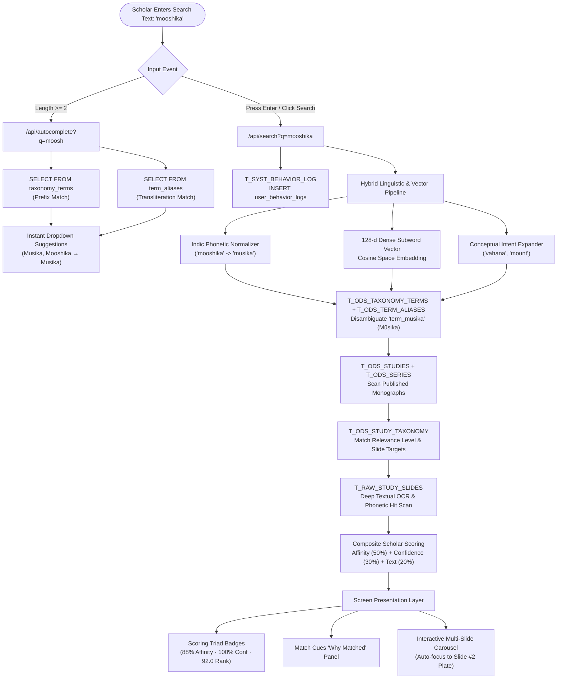

# Retrieval Architecture Overview: Multi-Tiered Hybrid Search

This document details the complete end-to-end retrieval architecture of the **Five Metal Masonry (FMM) Archival Research Engine**. It documents how a scholar's query is resolved across the Medallion database architecture, with a concrete, query-by-query trace for the search query: **`mooshika`**.

---

## 🏛️ 1. Architecture Flowchart



---

## 🗄️ 2. The 7 Medallion Tables in the Search Path

The retrieval pipeline bridges across the 3 tiers of the database:

| Tier | Table Name | Medallion Designation | Purpose in Search |
|---|---|---|---|
| 🔵 Silver | `taxonomy_terms` | `T_ODS_TAXONOMY_TERMS` | Resolves canonical Sanskrit terms, IAST transliterations, and categories. |
| 🔵 Silver | `taxonomy_types` | `T_ODS_TAXONOMY_TYPES` | Groups terms into categories (e.g. *Iconographic Element*, *Mudra*, *Asana*). |
| 🔵 Silver | `term_aliases` | `T_ODS_TERM_ALIASES` | Resolves colloquial spellings, regional scripts, and common OCR spelling variants. |
| 🔵 Silver | `studies` | `T_ODS_STUDIES` | Candidate published research monographs with titles, abstracts, and access tiers. |
| 🔵 Silver | `series` | `T_ODS_SERIES` | Thematic collection series (e.g. *Majors Iconography*, *108 Tandava*). |
| 🔵 Silver | `study_taxonomy_mappings` | `T_ODS_STUDY_TAXONOMY` | Verified relational bridge linking studies to specific taxonomy terms and slide numbers. |
| 🟤 Bronze | `study_slides` | `T_RAW_STUDY_SLIDES` | High-resolution photographic plates and raw/cleaned OCR transcriptions. |
| 🟡 Gold | `user_behavior_logs` | `T_SYST_BEHAVIOR_LOG` | Audit trail logging queries, timestamps, IPs, and session telemetry. |

---

## 🔍 3. Step-by-Step Retrieval Pipeline with Actuals for `'mooshika'`

### Step 1: Real-Time Autocomplete (`/api/autocomplete?q=moosh`)
As the scholar types `m-o-o-s-h` into the search bar, the UI debounces 250ms and queries the database for fast prefix suggestions.

#### SQL Query 1: Canonical Term Prefix Match
```sql
SELECT t.canonical_name, t.iast_name, tt.name AS category, t.slug
FROM taxonomy_terms t
JOIN taxonomy_types tt ON t.taxonomy_type_id = tt.id;
```

#### SQL Query 2: Transliteration & Alias Prefix Match
```sql
SELECT a.alias, t.canonical_name, tt.name AS category
FROM term_aliases a
JOIN taxonomy_terms t ON a.term_id = t.id
JOIN taxonomy_types tt ON t.taxonomy_type_id = tt.id;
```

#### 🎯 Actual Returned Autocomplete Payload:
```json
[
  { "type": "taxonomy_term", "label": "Musika (Mūṣika)", "term": "Musika", "category": "Iconographic Element" },
  { "type": "alias", "label": "Mushika → Musika", "term": "Mushika", "category": "Iconographic Element" },
  { "type": "alias", "label": "Mooshika → Musika", "term": "Mooshika", "category": "Iconographic Element" },
  { "type": "alias", "label": "Mooshik → Musika", "term": "Mooshik", "category": "Iconographic Element" },
  { "type": "alias", "label": "Mooshikam → Musika", "term": "Mooshikam", "category": "Iconographic Element" },
  { "type": "alias", "label": "Mūṣikavāhana → Musika", "term": "Mūṣikavāhana", "category": "Iconographic Element" },
  { "type": "alias", "label": "Musikavahana → Musika", "term": "Musikavahana", "category": "Iconographic Element" },
  { "type": "alias", "label": "Mooshikavahana → Musika", "term": "Mooshikavahana", "category": "Iconographic Element" }
]
```

---

### Step 2: Audit & Telemetry Logging (`T_SYST_BEHAVIOR_LOG`)
When the user submits the search, FastAPI immediately records the event for historical telemetry and curatorial insight:

```sql
INSERT INTO user_behavior_logs (id, user_id, event_type, payload, ip_address, user_agent, created_at)
VALUES (
    'log_892f3a',
    NULL,
    'search_query',
    'q=mooshika&series=None&divinity=None',
    '127.0.0.1',
    'Mozilla/5.0 (Windows NT 10.0; Win64; x64)...',
    CURRENT_TIMESTAMP
);
```

---

### Step 3: Indic Phonetic Normalization & Dense Subword Vector
1. **Raw Query:** `"mooshika"`
2. **Indic Normalizer:**
   - Double vowels collapsed: `"oo"` $\rightarrow$ `"u"`
   - Sibilants mapped: `"sh"` $\rightarrow$ `"s"`
   - Diacritics stripped: `Mūṣika` $\rightarrow$ `"musika"`
   - **Normalized Output:** **`"musika"`**
3. **Dense Vector:** Encodes query into a 128-dimensional unit vector in character n-gram cosine space.
4. **Conceptual Expander:** Identifies Mount/Vahana taxonomy associations.

---

### Step 4: Taxonomy & Alias Disambiguation Query
The search service checks the 92 taxonomy terms and aliases for exact, phonetic, or semantic affinity:

```sql
SELECT t.id, t.canonical_name, t.iast_name, tt.name AS category,
       COALESCE(a.alias, '') AS alias, COALESCE(a.alias_type, '') AS alias_type
FROM taxonomy_terms t
JOIN taxonomy_types tt ON t.taxonomy_type_id = tt.id
LEFT JOIN term_aliases a ON a.term_id = t.id;
```

#### 🎯 Actual Matched Term:
- **Term ID:** `term_musika`
- **Canonical Name:** `Musika`
- **IAST Standard:** `Mūṣika`
- **Category:** `Iconographic Element`
- **Matched Alias:** `Mooshika` (Alias Type: `phonetic_transliteration`, Match Weight: `1.0`)

---

### Step 5: Candidate Study Discovery
Fetches all active published monographs:

```sql
SELECT s.id, s.slug, s.title, s.subtitle, s.study_number,
       ser.id AS series_id, ser.name AS series_name,
       s.access_level, s.cover_image_url, s.total_slides,
       s.summary_markdown
FROM studies s
JOIN series ser ON s.series_id = ser.id
WHERE s.status = 'published';
```

---

### Step 6: Relational Knowledge Bridge Query (`T_ODS_STUDY_TAXONOMY`)
For each published study, verifies if `term_musika` has been documented by curators:

```sql
SELECT m.term_id, m.relevance_level, m.confidence_score, m.slide_numbers,
       t.canonical_name, t.iast_name, tt.name AS category
FROM study_taxonomy_mappings m
JOIN taxonomy_terms t ON m.term_id = t.id
JOIN taxonomy_types tt ON t.taxonomy_type_id = tt.id
WHERE m.study_id = 's_ganesa_001' AND m.term_id IN ('term_musika');
```

#### 🎯 Actual Returned Linkage:
- `study_id`: `s_ganesa_001`
- `relevance_level`: **`materially_discussed`**
- `confidence_score`: **`1.0`** (100% verified scholarly confidence)
- `slide_numbers`: **`[2, 3]`** (specifically mapped to Slide 2 and Slide 3)

---

### Step 7: Deep Slide OCR Text Scan (`T_RAW_STUDY_SLIDES`)
The engine fetches the individual slide plates and scans both cleaned and raw OCR text:

```sql
SELECT id, slide_number, slide_title, image_url, caption,
       COALESCE(cleaned_text, extracted_ocr_text) AS text
FROM study_slides
WHERE study_id = 's_ganesa_001'
ORDER BY slide_number ASC;
```

#### 🎯 Actual Hits Detected:
- **Slide 2 (`Taxonomy of Ganesa Variations: Postural, Anatomical, Regional`):**
  - **Hit Detail:** Phonetic transliteration hit matching `mooshika` $\rightarrow$ `musika` (`Mūṣikavāhana`).
- **Slide 3 (`Comparative Plate: 20 Iconographic Variations of Ganesa`):**
  - **Hit Detail:** Direct taxonomy element illustrated in plate (Mushika Vahana in register 1).

---

### Step 8: Multi-Factor Scoring & Composite Ranking
The engine computes the Scholar Scoring Triad:
- **Theme Affinity Score (50% weight):**
  $$\text{affinity\_score} = 88.0\% \quad (\text{from } \text{materially\_discussed} \text{ status})$$
- **Scholarly Confidence (30% weight):**
  $$\text{confidence\_score} = 100.0\% \quad (\text{from curatorial verification})$$
- **Text & Slide Presence (20% weight):**
  $$\text{text\_pts} = 0.90 \quad (\text{multiple slide occurrences})$$
- **Dense Vector Subword Cosine Similarity:**
  $$\text{study\_sim} = 50.9\%$$
- **Overall Composite Rank:**
  $$\text{rank\_score} = (0.88 \times 50) + (1.0 \times 30) + (0.90 \times 20) = \mathbf{92.0}$$

---

## 🖥️ 4. Screen Presentation Breakdown for `'mooshika'`

| Section on User's Screen | Source Data | Actual Value Displayed |
|---|---|---|
| **Results Count Header** | `data.total_results` | `Found 1 study matching query` |
| **Study Card Title Bar** | `s.title`, `ser.name`, `s.study_number` | **`Ganesa: Variations in Iconography`**<br>`Majors Iconography · Study 001` |
| **Scoring Triad: Affinity** | `affinity_score` | **`88% Theme Affinity`** |
| **Scoring Triad: Confidence** | `confidence_score` | **`100% Confidence`** |
| **Scoring Triad: Overall Rank** | `rank_score` | **`92.0 Rank Score`** |
| **"Why Matched" Match Cues** | Generated explainability cues | • `Taxonomy Material Discussion: Iconographic Element = 'Musika' (Mūṣika) in Slides [2, 3] [Exact/substring match on 'Mooshika']`<br>• `Deep Slide OCR Hit: Identified in Slide(s) [2, 3]`<br>• `Dense Vector Subword Affinity: 50.9% cosine similarity` |
| **Slide Carousel Stage** | Auto-focus logic: `slides.findIndex(sl => sl.has_term_hit)` | **Automatically focuses to Slide #2 Plate** (`Taxonomy of Ganesa Variations`) |
| **Slide Filmstrip Thumbnails** | `has_term_hit: true` | Slide **#2** and Slide **#3** highlight with green glowing hit rings |

---

## 📁 5. Accompanying SQL Artifacts

1. **[ddl.sql](file:///C:/Users/anant/Downloads/FMM/app/ddl.sql)**: Contains the clean, complete Data Definition Language (DDL) for all 20 tables across the 3 Medallion layers.
2. **[dml.sql](file:///C:/Users/anant/Downloads/FMM/app/dml.sql)**: Contains the static reference seed data (DML) for series, studies, taxonomy types, canonical terms, aliases, dictionary entries, document catalogs, temple places, and photographic plates.
